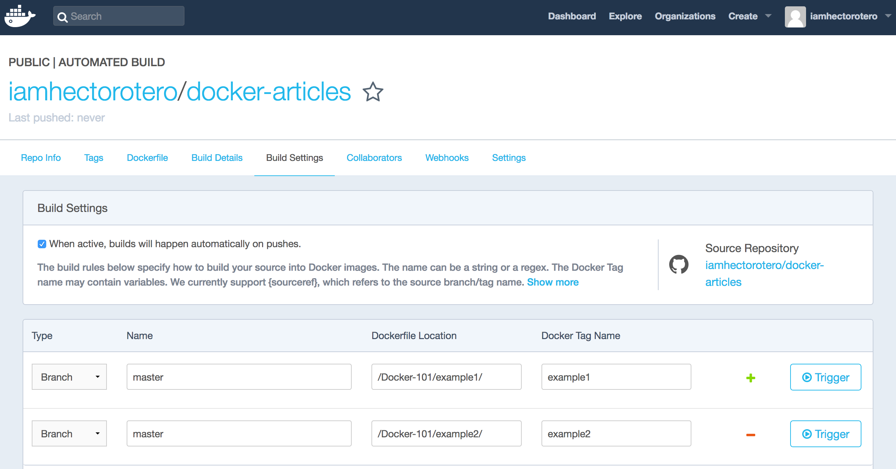

*Disclaimer: This is not an in-depth introduction to Docker and only aims at pointing out its utility and ease of use*. 

*Although not necessary to follow along, the contents of the examples run have been made available in a [repository in Github.](https://github.com/iamhectorotero/docker-articles)*


## What's Docker?

<div align="center"></div>

**Docker** is an open-source project that allows to create Linux containers. A **container** defines an environment 
that includes only system libraries and allows applications or services to be run. The container is run as a process 
in the host OS which makes them **much** **lighter** than Virtual Machines (which include a Guest OS). As with VMs, 
several *containers* can be run on the same machine and can be configured to communicate with one another. 

<div align="center"></div>

## Why Docker?

Briefly, the philosophy behind Docker:

- Avoiding having projects that *only* run on certain machines. 
- Being sure your project will run *anywhere* where Docker can be installed. 
- The ability to stop and start an application *at will* in case it's not working correctly.
- Ease of communication among services.

## How to use Docker?

#### Install Docker

For Ubuntu: [https://docs.docker.com/engine/installation/linux/docker-ce/ubuntu/]()

For Mac: [https://store.docker.com/editions/community/docker-ce-desktop-mac]()

For Windows: [https://store.docker.com/editions/community/docker-ce-desktop-windows]()

#### The simplest Dockerfile

A Dockerfile is the definition of a Docker container, it specifies what it will be composed of and what will be 
executed when the container is built. The easiest example of a Dockerfile consists of a single line:

```
FROM ubuntu
```

If we type this line into a file named "Dockerfile" and execute the following command in the same directory:

```shell
docker build . -t my_ubuntu_image:0.1
```

we should see the how Docker downloads an Ubuntu image and names it my_ubuntu_image:0.1. Typing `docker images` in the 
shell should show two entries, one for *ubuntu* (the base image) and one for our recently created image, 
*my_ubuntu-image* with the tag 0.1. 

Running:

```shell
docker run -it my_ubuntu_image:0.1
```

should log us into the shell of our container.

<div align="center"></div>

- ```FROM ubuntu``` specifies the base image we will use to build our containers. By default, the latest image available 
will be used (more on images and how to find and create them later).
- ```docker build .``` looks for a *Dockerfile* file in the directory passed as parameter and builds its image (we can 
use -f and specify its name if it's called some other way). `-t my_ubuntu_image:0.1` names the container image 
we're creating as *my_ubuntu_image* and tags it with whatever comes after the colon (*0.1* in our case).
- `docker run -it my_ubuntu_image:0.1 ` looks for the image tagged as *my_ubuntu_image:0.1*. The parameters `-it` 
specify that we want to run an interactive shell. If we remove `-it` and add any command behind the image specification 
it will work as if we ran it directly on the container shell. (Try for example `docker run my_ubuntu_image:0.1 ls`)

#### A more complex Dockerfile 

Let's create a directory with three files: ``script.py`` , ``requirements.txt`` and the ``Dockerfile``. Below we can 
see their contents:

```
#Dockerfile
FROM python:3.5.2

COPY . /app

WORKDIR /app

ENV SCRIPTVAR Hello\ Docker!

RUN pip install -r requirements.txt

CMD python script.py
```

```python
#script.py
import os, numpy

print(os.environ["SCRIPTVAR"])
print(numpy.zeros(5))
```

```
#requirements.txt
numpy==1.13.1
```
This time the Docker container we build parts from an image that has Python 3.5.2 installed in it. The lines 
afterwards are pretty easy to understand. `COPY` *copies* the contents of the first directory in the local host to the
second directory in the container; `WORKDIR` changes the current directory in the container to the one passed as parameter;
`ENV`, defines the value of a environment variable; `RUN` (well...) runs the given command in the container; finally,
`CMD` defines the command that will run when executing `docker run <image-name>`.

Thus, executing the following commands:
```
docker build . -t script_image
docker run script_image
``` 
will copy the contents of the current directory (Dockerfile, requirements.txt and script.py) to the */app* directory in the container, define SCRIPTVAR in the container 
and install the requirements.txt in the container. Executing `docker run script_image` will run the script and print
"Hello Docker!" and a numpy array of 5 zeros. 

## Where to store Docker images?

Obviously, storing your images locally, building and tagging them manually everytime is a hustle nobody wants to go through. Reason why, **Dockerhub** exists. Dockerhub allows you to share Docker images through private or public repositories. 

In order to do so, you first need to create an account in Dockerhub and create a repository. Afterwards use `docker login` in your shell to sign into your Docker account. Then, you need to build the image and name it as your repository. Once this is done, you're ready to push your image to Dockerhub.

```shell
docker login
docker build . -t <dockerhub-username>/<dockerhub-repository-name>
docker push <dockerhub-username>/<dockerhub-repository-name>
```
A problem with doing this is that (even if public) the contents of your image remain a mistery. Of course you can include a thorough description of what's included but this would need to be changed each time the image changes and, let's face it, it's a task we're not willing to do. 

Good news are, that **automated builds** solve this problem and a couple others. By linking your Dockerhub account to a Github or BitBucket account you can configure the Dockerhub to scan a certain branch and directory in your git project to generate a Docker image from the Dockerfile found. 


This will do the following for you:

- Making the contents of your Dockerfile available through Dockerhub.
- Making the contents of referenced build files (such as requirements.txt) available through git (linked by Dockerhub).
- Building a new image each time there's a push to the git repository.
- Allowing for version control.
- Allowing for different co-existing and well-organized versions of your Docker image. 



For our working example, I've configured two different versions of the image that will work for our first and second examples. These builds, make available the images to be pulled and run like so:


```shell
docker run -it iamhectorotero/docker-articles:example1
docker run iamhectorotero/docker-articles:example2
```

These two commands will automatically pull the images from Dockerhub and run them, obtaining the same results as in the previous sections.

For a more detailed process and specification on how to create and personalized builds and triggers, Docker has [a very cool tutorial](https://docs.docker.com/docker-hub/builds).

## Some important remarks

- When using a base image, always specify its version after its name (*python:3.5.2* rather than *python*) as leaving it empty would make it the latest version, which may change, defeating the purpose of making sure which libraries are being used. 

- Likewise, when generating images yourself tag them with a version, for you to be able to follow which one you're using. 

-  Make it a habit to specify the version on the rest of your requirements. Let's say you need to install Numpy as a requirement; you want to be sure what version you're installing as two builds of the same image where its version is not specified (will default to the *latest* version) may generate different results or even make the program fail.

- Images downloaded to your machine, obviously occupy space. `docker rm <container-id>` can be used to remove a container and `docker rmi <image-id>` to remove an image. You'll need to force the removal of an image if there's a container (either running or stopped) that was created with the image. `docker ps -a` shows all the created containers. A couple handy commands to clean up all the containers and images available are shown below.

```
docker rm $(docker ps -q -a)
docker rmi $(docker images -q)
```
- Each one of the lines specified in your Dockerfile acts as a *layer* in your image. Thus, if you change only the last layer of your image, only that one will be rebuilt, making it a much faster process. 

- You can specify in your Dockerfile an **ENTRYPOINT**. An entrypoint is the prefix that will be placed before any argument you decide to put in a `docker run` command. The default *ENTRYPOINT* is `/bin/sh -c`, reason why RUN just executes the command passed afterwards. You may choose to change it, in order to, for example, limit the functionality of the image to executing python scripts by setting `ENTRYPOINT python`. 

## Next on: Docker 102

On [Docker 102](/docker-102), I talk about communicating a Docker container with the outside world and other containers.
